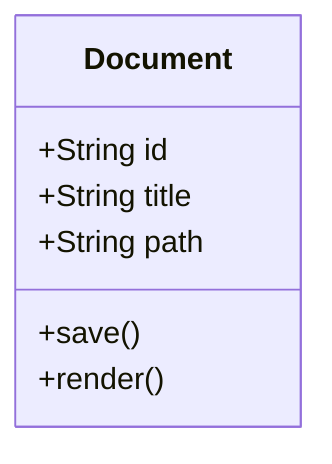
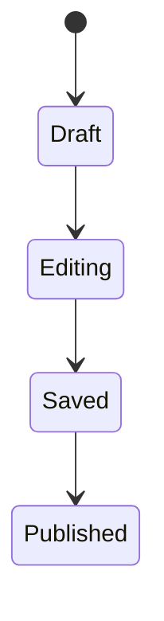
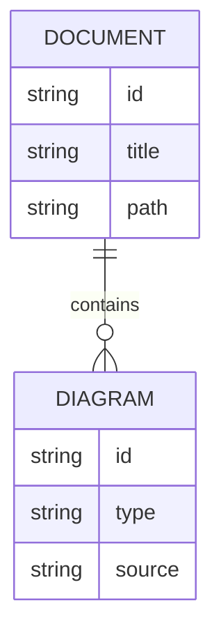
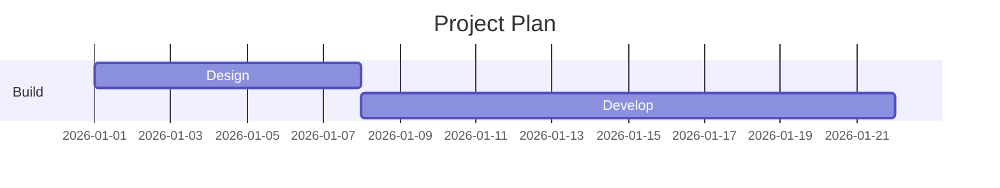
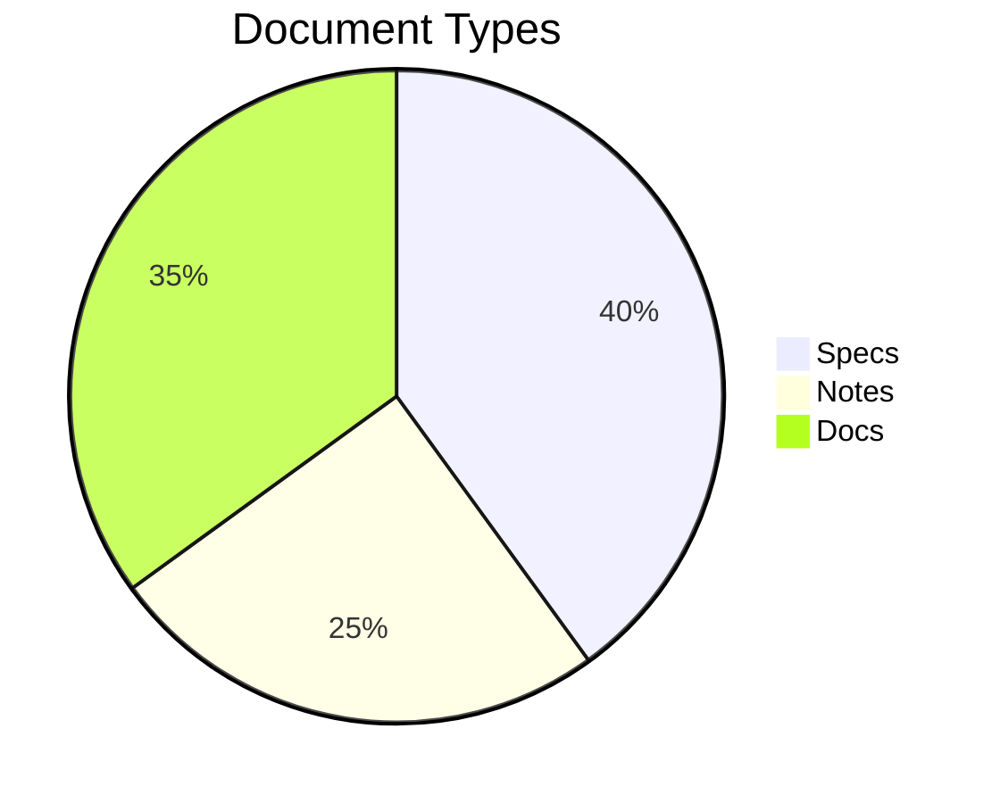
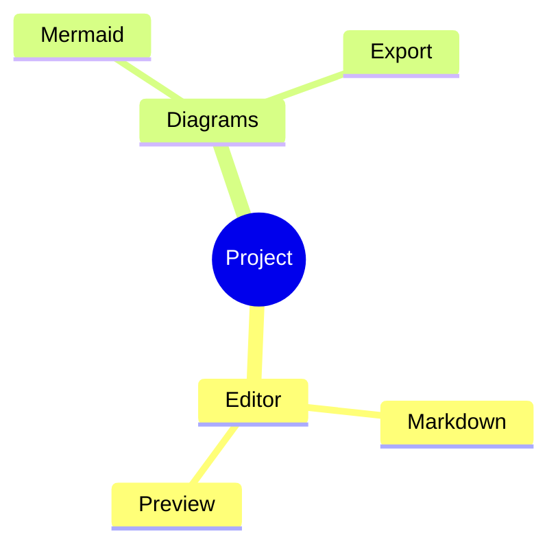
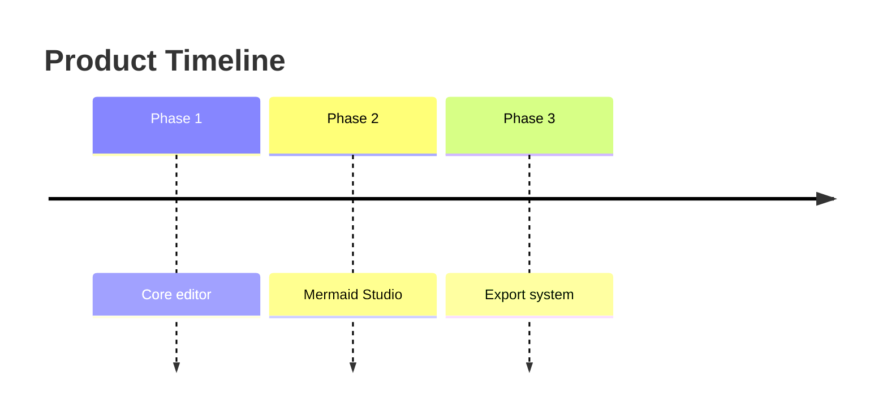

# SPEC.md — Tauri/Rust Markdown Editor with Mermaid Studio

## 1. Product Name

**MarkForge**

A professional-grade, cross-platform Markdown editor built with **Tauri 2**, **Rust**, **React**, **TypeScript**, and a modern editor core. It is designed for writers, developers, technical authors, product teams, and documentation-heavy engineering workflows.

The application must feel like a focused writing tool, a developer-grade Markdown IDE, and a diagram authoring studio in one package.

---

## 2. Product Goals

MarkForge must provide:

1. A fast native-feeling desktop Markdown editor.
2. Full Markdown editing, preview, export, and document management.
3. First-class Mermaid diagram authoring, preview, validation, and export.
4. A complete menu system: File, Edit, View, Insert, Format, Diagram, Export, Tools, Window, Help.
5. A project/workspace model similar to lightweight IDEs.
6. Secure local file access through Tauri permissions.
7. Keyboard-driven workflows for power users.
8. A polished UI that feels modern, not like a demo.
9. A clean Rust backend for file I/O, export, search indexing, settings, and native dialogs.
10. A Cursor-friendly architecture that can be implemented incrementally.

---

## 3. Target Platforms

The app must support:

* Windows 10+
* Windows 11
* macOS Intel
* macOS Apple Silicon
* Linux AppImage
* Linux `.deb`
* Linux `.rpm` if packaging supports it cleanly

---

## 4. Technology Stack

### 4.1 Desktop Runtime

Use:

* Tauri 2
* Rust stable
* Tokio for async backend operations
* Serde / serde_json for serialization
* tauri-plugin-dialog
* tauri-plugin-fs
* tauri-plugin-shell only if explicitly needed
* tauri-plugin-store or a Rust-managed config file for settings

### 4.2 Frontend

Use:

* React
* TypeScript
* Vite
* Zustand or Redux Toolkit for state
* TanStack Query only if async state becomes complex
* Monaco Editor as the main text editor
* markdown-it for Markdown rendering
* Mermaid.js for Mermaid rendering
* DOMPurify for sanitized preview HTML
* shiki or highlight.js for code highlighting
* lucide-react for icons
* Radix UI or Ariakit for accessible primitives
* Tailwind CSS for styling

### 4.3 Backend Rust Crates

Suggested crates:

```toml
[dependencies]
tauri = "2"
tauri-plugin-dialog = "2"
tauri-plugin-fs = "2"
serde = { version = "1", features = ["derive"] }
serde_json = "1"
tokio = { version = "1", features = ["full"] }
anyhow = "1"
thiserror = "2"
pulldown-cmark = "0.12"
notify = "8"
walkdir = "2"
ignore = "0.4"
uuid = { version = "1", features = ["v4", "serde"] }
chrono = { version = "0.4", features = ["serde"] }
dirs = "6"
```

Frontend dependencies:

```json
{
  "dependencies": {
    "@tauri-apps/api": "latest",
    "@monaco-editor/react": "latest",
    "monaco-editor": "latest",
    "react": "latest",
    "react-dom": "latest",
    "zustand": "latest",
    "markdown-it": "latest",
    "markdown-it-anchor": "latest",
    "markdown-it-task-lists": "latest",
    "markdown-it-footnote": "latest",
    "markdown-it-container": "latest",
    "markdown-it-table-of-contents": "latest",
    "mermaid": "latest",
    "dompurify": "latest",
    "highlight.js": "latest",
    "lucide-react": "latest",
    "tailwindcss": "latest",
    "@radix-ui/react-dialog": "latest",
    "@radix-ui/react-dropdown-menu": "latest",
    "@radix-ui/react-tabs": "latest",
    "@radix-ui/react-tooltip": "latest",
    "@radix-ui/react-popover": "latest"
  }
}
```

---

## 5. Core User Experience

The app has five primary modes:

1. **Editor Mode**

   * Markdown editor only.
   * Distraction-free writing.
   * Optional sidebar hidden.

2. **Split Mode**

   * Editor on the left.
   * Live preview on the right.
   * Scroll synchronization.

3. **Preview Mode**

   * Rendered Markdown only.
   * Useful for reading final output.

4. **Mermaid Studio Mode**

   * Dedicated diagram editor.
   * Mermaid source on the left.
   * Rendered diagram on the right.
   * Diagram templates, validation, export, and theme selection.

5. **Workspace Mode**

   * File tree.
   * Open tabs.
   * Outline panel.
   * Search panel.
   * Document metadata panel.

---

## 6. Main Window Layout

The main window must include:

```text
┌───────────────────────────────────────────────────────────────┐
│ App Menu: File Edit View Insert Format Diagram Export Tools... │
├───────────────────────────────────────────────────────────────┤
│ Toolbar: New Open Save Undo Redo Bold Italic Link Diagram ...  │
├──────────────┬────────────────────────────┬───────────────────┤
│ Workspace    │ Editor Tabs                │ Right Sidebar      │
│ File Tree    ├────────────────────────────┤ Outline / Preview  │
│ Search       │ Markdown Editor            │ Mermaid Inspector  │
│ Recent Files │                            │ Document Stats     │
├──────────────┴────────────────────────────┴───────────────────┤
│ Status Bar: file path | words | chars | line/col | saved state │
└───────────────────────────────────────────────────────────────┘
```

### 6.1 Left Sidebar

The left sidebar must support:

* Workspace file tree
* Recent files
* Global search
* Document collections
* Favorites
* Drafts
* Export history
* Mermaid diagrams detected in current file

### 6.2 Center Editor Area

The center area must support:

* Multiple tabs
* Unsaved state indicator
* Split editor/preview layout
* Markdown syntax highlighting
* Mermaid syntax highlighting inside fenced blocks
* Markdown lint warnings
* Inline formatting helpers
* Find/replace
* Command palette

### 6.3 Right Sidebar

The right sidebar must support:

* Table of contents
* Document outline
* Mermaid diagram inspector
* Link checker
* Footnote list
* Image assets
* Document metadata
* Word count
* Reading time
* Export settings

### 6.4 Status Bar

The status bar must show:

* Current file path
* Git branch if inside a Git repository
* Saved/unsaved state
* Word count
* Character count
* Line and column
* Current mode: Editor, Split, Preview, Mermaid Studio
* Mermaid validation status
* Markdown lint status
* Encoding
* Line endings

---

## 7. Menu System

The app must implement a full native-feeling menu system.

### 7.1 File Menu

Items:

* New File
* New Window
* Open File
* Open Folder / Workspace
* Open Recent
* Save
* Save As
* Save All
* Duplicate File
* Rename File
* Move File
* Reveal in File Manager
* Close File
* Close Workspace
* Import
* Export
* Print
* Preferences
* Exit / Quit

### 7.2 Edit Menu

Items:

* Undo
* Redo
* Cut
* Copy
* Paste
* Paste as Plain Text
* Select All
* Find
* Replace
* Find in Files
* Go to Line
* Go to Heading
* Toggle Comment
* Duplicate Line
* Delete Line
* Move Line Up
* Move Line Down
* Sort Selected Lines
* Trim Trailing Whitespace
* Convert Tabs to Spaces
* Convert Spaces to Tabs

### 7.3 View Menu

Items:

* Editor Only
* Split View
* Preview Only
* Mermaid Studio
* Toggle Sidebar
* Toggle Right Panel
* Toggle Toolbar
* Toggle Status Bar
* Toggle Zen Mode
* Toggle Typewriter Mode
* Toggle Word Wrap
* Toggle Minimap
* Zoom In
* Zoom Out
* Reset Zoom
* Theme
* Font Size
* Editor Font
* Preview Font

### 7.4 Insert Menu

Items:

* Heading 1
* Heading 2
* Heading 3
* Bold
* Italic
* Strikethrough
* Inline Code
* Code Block
* Blockquote
* Ordered List
* Unordered List
* Task List
* Link
* Image
* Table
* Horizontal Rule
* Footnote
* Callout
* Mermaid Diagram
* Date
* Time
* Frontmatter Block
* HTML Block

### 7.5 Format Menu

Items:

* Format Document
* Format Selection
* Normalize Headings
* Renumber Ordered Lists
* Convert Selection to Table
* Convert Selection to Task List
* Toggle Smart Quotes
* Toggle Soft Line Breaks
* Wrap Paragraph
* Unwrap Paragraph
* Clean Markdown
* Fix Markdown Tables
* Fix Mermaid Block Indentation

### 7.6 Diagram Menu

Items:

* New Mermaid Diagram
* Insert Flowchart
* Insert Sequence Diagram
* Insert Class Diagram
* Insert State Diagram
* Insert Entity Relationship Diagram
* Insert Gantt Chart
* Insert Pie Chart
* Insert Mindmap
* Insert Timeline
* Validate Current Diagram
* Validate All Diagrams
* Render Current Diagram
* Render All Diagrams
* Export Diagram as SVG
* Export Diagram as PNG
* Export Diagram as PDF
* Copy Diagram as SVG
* Copy Diagram as PNG
* Copy Diagram Source
* Open in Mermaid Studio
* Diagram Theme
* Diagram Layout
* Diagram Templates

### 7.7 Export Menu

Items:

* Export to HTML
* Export to PDF
* Export to DOCX
* Export to Markdown
* Export to Plain Text
* Export to Reveal.js Slides
* Export Current Mermaid Diagram
* Export All Mermaid Diagrams
* Export Workspace as Static Site
* Export With Assets
* Export Settings

### 7.8 Tools Menu

Items:

* Command Palette
* Markdown Linter
* Link Checker
* Spell Check
* Word Count
* Document Stats
* Reading Time
* Table Formatter
* Image Asset Manager
* Frontmatter Editor
* Snippet Manager
* Template Manager
* Backup Manager
* Settings Sync
* Developer Tools

### 7.9 Window Menu

Items:

* Minimize
* Maximize
* Fullscreen
* New Window
* Next Tab
* Previous Tab
* Split Editor
* Move Tab Left
* Move Tab Right
* Close Tab
* Reopen Closed Tab

### 7.10 Help Menu

Items:

* MarkForge Help
* Markdown Guide
* Mermaid Guide
* Keyboard Shortcuts
* Release Notes
* Report Issue
* Check for Updates
* About MarkForge

---

## 8. Markdown Feature Requirements

The Markdown editor must support:

* CommonMark
* GitHub Flavored Markdown
* Tables
* Task lists
* Footnotes
* Definition lists
* Frontmatter
* Fenced code blocks
* Syntax highlighting
* Inline HTML with sanitization in preview
* Math blocks, optional
* Callouts / admonitions
* Heading anchors
* Table of contents generation
* Smart typography, optional
* Automatic list continuation
* Markdown table formatting
* Drag-and-drop image insertion
* Paste image from clipboard
* Relative asset path management
* Link autocomplete for workspace files
* Heading autocomplete for internal anchors
* Wikilinks, optional but recommended
* Backlinks, optional but recommended

---

## 9. Mermaid Feature Requirements

Mermaid support must be treated as a first-class feature, not a preview hack.

### 9.1 Mermaid Detection

The app must detect fenced blocks:

````markdown
```mermaid
flowchart TD
  A[Start] --> B[End]
````

````

The app must also support alternate language aliases:

- `mermaid`
- `mmd`
- `diagram`
- `mermaid-flowchart`
- `mermaid-sequence`

### 9.2 Mermaid Rendering

The preview renderer must:

- Render Mermaid diagrams inline.
- Show loading state while rendering.
- Show meaningful errors when syntax fails.
- Preserve source block if rendering fails.
- Support multiple diagrams per document.
- Render diagrams independently so one broken diagram does not break the whole preview.
- Use stable diagram IDs.
- Avoid duplicate ID collisions.
- Re-render only changed diagrams when possible.

### 9.3 Mermaid Studio

Mermaid Studio is a dedicated workspace for diagram authoring.

It must include:

- Mermaid source editor
- Live preview
- Diagram type selector
- Template selector
- Theme selector
- Export buttons
- Validation panel
- Error list
- Zoom controls
- Pan controls
- Fit to screen
- Copy SVG
- Copy PNG
- Copy Mermaid source
- Insert into Markdown document
- Replace existing diagram block
- Save diagram as standalone `.mmd`
- Save diagram as embedded Markdown fenced block

### 9.4 Mermaid Templates

Include built-in templates:

#### Flowchart

```mermaid
flowchart TD
  Start([Start]) --> Decision{Decision}
  Decision -->|Yes| Action[Action]
  Decision -->|No| Stop([Stop])
  Action --> Stop
````

#### Sequence Diagram

```mermaid
sequenceDiagram
  participant User
  participant App
  participant Backend
  User->>App: Perform action
  App->>Backend: Send request
  Backend-->>App: Return result
  App-->>User: Show response
```

#### Class Diagram



#### State Diagram



#### ER Diagram



#### Gantt Chart



#### Pie Chart



#### Mindmap



#### Timeline



### 9.5 Mermaid Export

The app must export diagrams as:

* SVG
* PNG
* PDF
* Mermaid source
* Embedded HTML snippet

Export behavior:

* Export current diagram.
* Export all diagrams in current document.
* Export all diagrams in workspace.
* Preserve transparent background option.
* Support light and dark themes.
* Support custom scale factor.
* Support filename pattern:

  * `{document_slug}-{diagram_index}-{diagram_type}.svg`

---

## 10. Editor Requirements

Use Monaco Editor unless there is a strong reason not to.

The editor must support:

* Markdown syntax highlighting
* Mermaid fenced block highlighting
* Line numbers
* Soft wrap
* Minimap toggle
* Bracket matching
* Selection formatting
* Multi-cursor editing
* Search
* Replace
* Go to line
* Go to heading
* Command palette
* Markdown snippets
* Mermaid snippets
* Autosave
* Dirty file tracking
* Crash-safe recovery
* Multiple tabs
* Recently closed tabs
* Split editor view
* Keyboard shortcuts
* Configurable font family
* Configurable font size
* Configurable tab size
* Configurable line height

---

## 11. Preview Requirements

The preview pane must support:

* Live rendering
* Debounced rendering
* Scroll sync from editor to preview
* Scroll sync from preview to editor
* Code highlighting
* Mermaid rendering
* Table of contents
* Heading anchors
* Clickable internal links
* Clickable external links
* Safe external link handling through Tauri shell permissions
* Image rendering
* Relative image paths
* Local asset loading
* Task list rendering
* Footnote rendering
* Callout rendering
* Frontmatter hiding or display toggle
* Print stylesheet
* Export stylesheet

Preview must never execute untrusted scripts from Markdown content.

---

## 12. Workspace Model

A workspace is a folder opened by the user.

The app must support:

* Open folder
* File tree
* Create file
* Create folder
* Rename file
* Delete file
* Move file
* Duplicate file
* Search files
* Filter files
* Ignore rules using `.gitignore`
* Markdown-only filter
* Asset folder detection
* Workspace settings file

Workspace settings file:

```json
{
  "name": "My Docs",
  "defaultExportFormat": "pdf",
  "previewTheme": "system",
  "mermaidTheme": "default",
  "assetsFolder": "assets",
  "exclude": ["node_modules", ".git", "dist"]
}
```

Store as:

```text
.markforge/workspace.json
```

---

## 13. File Model

Each open file must track:

```ts
type OpenDocument = {
  id: string;
  path: string | null;
  title: string;
  content: string;
  originalContent: string;
  isDirty: boolean;
  isNew: boolean;
  encoding: "utf-8";
  lineEnding: "lf" | "crlf";
  lastSavedAt: string | null;
  lastOpenedAt: string;
  cursorPosition: {
    line: number;
    column: number;
  };
  scrollTop: number;
};
```

---

## 14. App State Model

Frontend app state:

```ts
type AppState = {
  workspacePath: string | null;
  openDocuments: OpenDocument[];
  activeDocumentId: string | null;
  editorMode: "editor" | "split" | "preview" | "mermaid-studio";
  sidebarVisible: boolean;
  rightPanelVisible: boolean;
  toolbarVisible: boolean;
  statusBarVisible: boolean;
  theme: "system" | "light" | "dark";
  previewTheme: "github" | "minimal" | "technical" | "book";
  mermaidTheme: "default" | "dark" | "forest" | "neutral";
  recentFiles: RecentFile[];
  recentWorkspaces: RecentWorkspace[];
  settings: AppSettings;
};
```

---

## 15. Settings

Global settings must be stored locally.

Example:

```json
{
  "theme": "system",
  "editor": {
    "fontFamily": "JetBrains Mono, Menlo, Consolas, monospace",
    "fontSize": 14,
    "lineHeight": 1.6,
    "tabSize": 2,
    "wordWrap": true,
    "minimap": false,
    "autoSave": true,
    "autoSaveDelayMs": 750
  },
  "preview": {
    "theme": "github",
    "syncScroll": true,
    "sanitizeHtml": true
  },
  "mermaid": {
    "theme": "default",
    "securityLevel": "strict",
    "startOnLoad": false,
    "htmlLabels": false
  },
  "export": {
    "defaultFormat": "pdf",
    "includeStyles": true,
    "includeMermaidDiagrams": true
  },
  "files": {
    "restoreLastSession": true,
    "confirmBeforeDelete": true,
    "createBackups": true
  }
}
```

---

## 16. Rust Backend Commands

Implement Tauri commands.

### 16.1 File Commands

```rust
#[tauri::command]
async fn read_text_file(path: String) -> Result<TextFileResponse, AppError>;

#[tauri::command]
async fn write_text_file(path: String, content: String) -> Result<(), AppError>;

#[tauri::command]
async fn create_file(path: String, content: Option<String>) -> Result<(), AppError>;

#[tauri::command]
async fn delete_file(path: String) -> Result<(), AppError>;

#[tauri::command]
async fn rename_file(old_path: String, new_path: String) -> Result<(), AppError>;

#[tauri::command]
async fn list_directory(path: String) -> Result<Vec<FileEntry>, AppError>;

#[tauri::command]
async fn read_workspace(path: String) -> Result<WorkspaceTree, AppError>;
```

### 16.2 Settings Commands

```rust
#[tauri::command]
async fn load_settings() -> Result<AppSettings, AppError>;

#[tauri::command]
async fn save_settings(settings: AppSettings) -> Result<(), AppError>;
```

### 16.3 Search Commands

```rust
#[tauri::command]
async fn search_workspace(
    workspace_path: String,
    query: String,
    file_glob: Option<String>
) -> Result<Vec<SearchResult>, AppError>;
```

### 16.4 Export Commands

```rust
#[tauri::command]
async fn export_markdown_to_html(
    markdown: String,
    options: HtmlExportOptions
) -> Result<ExportResult, AppError>;

#[tauri::command]
async fn export_markdown_to_pdf(
    markdown: String,
    options: PdfExportOptions
) -> Result<ExportResult, AppError>;

#[tauri::command]
async fn save_exported_file(
    path: String,
    bytes_base64: String
) -> Result<(), AppError>;
```

### 16.5 Backup Commands

```rust
#[tauri::command]
async fn save_recovery_snapshot(
    document_id: String,
    content: String
) -> Result<(), AppError>;

#[tauri::command]
async fn list_recovery_snapshots() -> Result<Vec<RecoverySnapshot>, AppError>;

#[tauri::command]
async fn restore_recovery_snapshot(snapshot_id: String) -> Result<String, AppError>;
```

---

## 17. Rust Data Structures

```rust
use serde::{Deserialize, Serialize};

#[derive(Debug, Serialize, Deserialize)]
pub struct TextFileResponse {
    pub path: String,
    pub content: String,
    pub encoding: String,
    pub line_ending: String,
    pub modified_at: Option<String>,
}

#[derive(Debug, Serialize, Deserialize)]
pub struct FileEntry {
    pub name: String,
    pub path: String,
    pub is_dir: bool,
    pub extension: Option<String>,
    pub size: Option<u64>,
    pub modified_at: Option<String>,
}

#[derive(Debug, Serialize, Deserialize)]
pub struct WorkspaceTree {
    pub root: String,
    pub entries: Vec<FileEntry>,
}

#[derive(Debug, Serialize, Deserialize)]
pub struct SearchResult {
    pub path: String,
    pub line: usize,
    pub column: usize,
    pub preview: String,
}

#[derive(Debug, Serialize, Deserialize)]
pub struct ExportResult {
    pub suggested_filename: String,
    pub mime_type: String,
    pub bytes_base64: String,
}

#[derive(Debug, Serialize, Deserialize)]
pub struct RecoverySnapshot {
    pub id: String,
    pub document_id: String,
    pub path: Option<String>,
    pub created_at: String,
    pub size: u64,
}
```

---

## 18. Error Handling

Create a central error type:

```rust
#[derive(Debug, thiserror::Error)]
pub enum AppError {
    #[error("File not found: {0}")]
    FileNotFound(String),

    #[error("Permission denied: {0}")]
    PermissionDenied(String),

    #[error("Invalid path: {0}")]
    InvalidPath(String),

    #[error("I/O error: {0}")]
    Io(String),

    #[error("Serialization error: {0}")]
    Serialization(String),

    #[error("Export failed: {0}")]
    ExportFailed(String),

    #[error("Unknown error: {0}")]
    Unknown(String),
}
```

All frontend errors must be displayed through a central toast/dialog system.

Error UX must include:

* Short human-readable title
* Technical details expandable
* Suggested fix
* Copy error button
* Report issue button

---

## 19. Security Requirements

The app must follow secure-by-default behavior.

### 19.1 File Access

* Use Tauri scoped filesystem permissions.
* Do not give blanket filesystem access by default.
* Only access user-selected files and folders.
* Store recent file paths locally.
* Never upload content anywhere.

### 19.2 Markdown Preview Security

* Sanitize rendered HTML.
* Disable arbitrary script execution.
* Prevent inline event handlers.
* Prevent `javascript:` URLs.
* External links must open through explicit safe handler.
* Mermaid must use strict security mode by default.

### 19.3 Plugin Policy

Initial version must not support arbitrary third-party plugins.

Future plugin system must be sandboxed.

---

## 20. Export System

The export system must support:

### 20.1 HTML Export

Options:

* Include CSS inline
* External CSS file
* Include Mermaid diagrams as SVG
* Include Mermaid source blocks
* Include table of contents
* Include frontmatter
* Include document metadata

### 20.2 PDF Export

Options:

* Page size: Letter, A4, Legal
* Orientation: Portrait, Landscape
* Margins
* Header
* Footer
* Page numbers
* Include Mermaid diagrams
* Print theme
* Code block wrapping

### 20.3 DOCX Export

DOCX export can be implemented through one of these strategies:

1. Use Pandoc if available and configured.
2. Use a Rust DOCX generation crate.
3. Use an internal HTML-to-DOCX pipeline.

The app must clearly show whether DOCX export is built-in or depends on an external binary.

### 20.4 Reveal.js Slides Export

Support Markdown slides separated by:

```markdown
---
```

and optionally:

```markdown
<!-- slide -->
```

Export as:

* Reveal.js folder
* Single HTML file if practical

---

## 21. Command Palette

The app must include a command palette opened with:

* Windows/Linux: `Ctrl+Shift+P`
* macOS: `Cmd+Shift+P`

Commands must include every major menu action.

Command item shape:

```ts
type CommandItem = {
  id: string;
  title: string;
  category: string;
  keywords: string[];
  shortcut?: string;
  run: () => void | Promise<void>;
};
```

Example commands:

* New File
* Open File
* Save File
* Toggle Split View
* Insert Mermaid Flowchart
* Export PDF
* Open Settings
* Toggle Zen Mode
* Format Markdown Table

---

## 22. Keyboard Shortcuts

Default shortcuts:

| Action          | Windows/Linux |        macOS |
| --------------- | ------------: | -----------: |
| New File        |        Ctrl+N |        Cmd+N |
| Open File       |        Ctrl+O |        Cmd+O |
| Open Folder     | Ctrl+K Ctrl+O |  Cmd+K Cmd+O |
| Save            |        Ctrl+S |        Cmd+S |
| Save As         |  Ctrl+Shift+S |  Cmd+Shift+S |
| Find            |        Ctrl+F |        Cmd+F |
| Replace         |        Ctrl+H | Cmd+Option+F |
| Command Palette |  Ctrl+Shift+P |  Cmd+Shift+P |
| Toggle Preview  |  Ctrl+Shift+V |  Cmd+Shift+V |
| Split View      |        Ctrl+\ |        Cmd+\ |
| Insert Link     |        Ctrl+K |        Cmd+K |
| Bold            |        Ctrl+B |        Cmd+B |
| Italic          |        Ctrl+I |        Cmd+I |
| Code Block      |  Ctrl+Shift+C |  Cmd+Shift+C |
| Mermaid Studio  |    Ctrl+Alt+M | Cmd+Option+M |
| Zen Mode        |           F11 |   Ctrl+Cmd+F |

Allow users to customize shortcuts later.

---

## 23. Markdown Formatting Tools

Implement these formatting helpers:

### 23.1 Wrap Selection

If user selects text and clicks Bold:

Before:

```markdown
hello
```

After:

```markdown
**hello**
```

### 23.2 Insert Table

Default table:

```markdown
| Column 1 | Column 2 | Column 3 |
|---|---|---|
| Value 1 | Value 2 | Value 3 |
```

### 23.3 Format Table

Before:

```markdown
|a|bb|
|-|-|
|one|two|
```

After:

```markdown
| a   | bb  |
| --- | --- |
| one | two |
```

### 23.4 Insert Callout

```markdown
> [!NOTE]
> Write your note here.
```

Support callout types:

* NOTE
* TIP
* IMPORTANT
* WARNING
* CAUTION

---

## 24. Linting

Markdown linting must detect:

* Missing H1
* Multiple H1s
* Skipped heading levels
* Trailing whitespace
* Inconsistent list markers
* Broken internal links
* Broken image references
* Empty links
* Empty headings
* Unclosed fenced code blocks
* Mermaid syntax errors
* Tables with inconsistent columns

Lint findings:

```ts
type LintFinding = {
  id: string;
  severity: "info" | "warning" | "error";
  message: string;
  line: number;
  column?: number;
  source: "markdown" | "mermaid" | "links" | "export";
  fix?: {
    label: string;
    apply: () => void;
  };
};
```

---

## 25. Link Checker

The link checker must support:

* Internal heading links
* Relative file links
* Relative image links
* External HTTP/HTTPS links
* Mailto links

External link checking should be manual, not automatic by default.

Reasons:

* Privacy
* Avoid unexpected network access
* Avoid slow editing experience

---

## 26. Asset Manager

The asset manager must support:

* List images used by current document
* List missing images
* Show unused assets in workspace
* Drag image into document
* Paste image from clipboard
* Copy image into workspace assets folder
* Rename assets and update references
* Convert absolute paths to relative paths

Default asset folder:

```text
assets/
```

---

## 27. Frontmatter Editor

If a Markdown file contains YAML frontmatter, expose it as editable fields.

Example:

```yaml
---
title: My Document
description: A useful document
tags:
  - docs
  - rust
  - tauri
draft: false
---
```

The frontmatter editor must:

* Parse YAML safely.
* Show form fields.
* Preserve unknown keys.
* Validate common fields.
* Allow raw YAML editing.
* Warn before destructive changes.

---

## 28. Snippet System

Snippet file:

````json
{
  "snippets": [
    {
      "id": "mermaid-flowchart-basic",
      "name": "Basic Mermaid Flowchart",
      "description": "Insert a simple top-down flowchart.",
      "body": "```mermaid\nflowchart TD\n  A[Start] --> B[End]\n```"
    }
  ]
}
````

Snippet features:

* Built-in snippets
* User snippets
* Search snippets
* Insert snippet
* Edit snippet
* Delete snippet
* Import/export snippets

---

## 29. Template System

Document templates:

* Blank document
* README
* SPEC.md
* Architecture document
* Product requirements document
* Meeting notes
* Decision record
* Runbook
* Incident report
* Blog post
* Mermaid diagram collection
* API documentation

Template file shape:

```json
{
  "id": "spec-md",
  "name": "SPEC.md",
  "description": "Software specification template.",
  "filename": "SPEC.md",
  "content": "# SPEC.md\n\n## Overview\n\n"
}
```

---

## 30. Session Restore

On app launch, optionally restore:

* Last workspace
* Open tabs
* Active tab
* Cursor positions
* Split mode
* Sidebar visibility
* Right panel visibility
* Unsaved recovery snapshots

Never silently overwrite files during recovery.

---

## 31. Autosave and Recovery

Autosave behavior:

* User-configurable.
* Default enabled.
* Delay: 750 ms after last change.
* For existing files, save directly if autosave is enabled.
* For new unsaved files, save recovery snapshots only.

Recovery snapshots:

* Stored in app data directory.
* Pruned after successful save.
* Retained if app crashes.
* Listed on next launch if recovery data exists.

---

## 32. Git Awareness

Initial Git support should be read-only.

Show:

* Current branch
* Modified files
* New files
* Deleted files
* Current file Git status

Do not implement commit/push/pull in version 1 unless everything else is stable.

---

## 33. UI Design Direction

Visual style:

* Clean
* Fast
* Dense but readable
* Dark mode first
* Light mode polished
* Developer-friendly
* Not cartoonish
* Not Electron-looking
* No bloated shadows
* No noisy gradients

### 33.1 Theme Tokens

```css
:root {
  --bg-app: #0f1115;
  --bg-panel: #151922;
  --bg-panel-elevated: #1b2130;
  --border-subtle: #2a3142;
  --text-primary: #f2f5f8;
  --text-secondary: #aeb7c5;
  --text-muted: #737d8c;
  --accent: #7aa2ff;
  --accent-strong: #9bb8ff;
  --danger: #ff6b6b;
  --warning: #ffd166;
  --success: #65d6a6;
}
```

### 33.2 Layout Density

Provide three density modes:

* Comfortable
* Compact
* Dense

### 33.3 Preview Themes

Built-in preview themes:

* GitHub
* Minimal
* Technical
* Book
* Presentation
* Dark Technical

---

## 34. Component Architecture

Frontend folders:

```text
src/
  app/
    App.tsx
    providers.tsx
    routes.tsx
  components/
    layout/
      AppShell.tsx
      MenuBar.tsx
      Toolbar.tsx
      StatusBar.tsx
      Sidebar.tsx
      RightPanel.tsx
      TabBar.tsx
    editor/
      MarkdownEditor.tsx
      EditorToolbar.tsx
      FindReplacePanel.tsx
      MonacoMarkdown.tsx
    preview/
      MarkdownPreview.tsx
      PreviewRenderer.tsx
      MermaidRenderer.tsx
      CodeBlock.tsx
      TableOfContents.tsx
    mermaid/
      MermaidStudio.tsx
      MermaidEditor.tsx
      MermaidPreview.tsx
      MermaidTemplates.tsx
      MermaidInspector.tsx
      MermaidExportPanel.tsx
    workspace/
      FileTree.tsx
      RecentFiles.tsx
      SearchPanel.tsx
      AssetManager.tsx
    dialogs/
      SettingsDialog.tsx
      ExportDialog.tsx
      LinkDialog.tsx
      ImageDialog.tsx
      CommandPalette.tsx
      AboutDialog.tsx
  lib/
    markdown/
      markdownParser.ts
      markdownPlugins.ts
      markdownFormatter.ts
      markdownLinter.ts
    mermaid/
      mermaidConfig.ts
      mermaidParser.ts
      mermaidTemplates.ts
      mermaidExport.ts
    tauri/
      commands.ts
      files.ts
      settings.ts
    state/
      appStore.ts
      documentStore.ts
      workspaceStore.ts
      settingsStore.ts
  styles/
    globals.css
    themes.css
```

Rust folders:

```text
src-tauri/
  src/
    main.rs
    commands/
      mod.rs
      files.rs
      settings.rs
      workspace.rs
      search.rs
      export.rs
      recovery.rs
    models/
      mod.rs
      files.rs
      settings.rs
      workspace.rs
      export.rs
      errors.rs
    services/
      mod.rs
      file_service.rs
      settings_service.rs
      workspace_service.rs
      search_service.rs
      export_service.rs
      recovery_service.rs
    security/
      mod.rs
      path_guard.rs
```

---

## 35. Tauri Permissions

Configure capabilities so only necessary APIs are available.

Example intent:

```json
{
  "identifier": "main-capability",
  "windows": ["main"],
  "permissions": [
    "core:default",
    "dialog:default",
    "fs:default"
  ]
}
```

Tighten this after initial implementation.

Do not grant shell/network permissions unless the feature requires it.

---

## 36. Markdown Rendering Pipeline

Pipeline:

```text
Raw Markdown
  ↓
Extract frontmatter
  ↓
Parse Markdown with markdown-it
  ↓
Detect fenced Mermaid blocks
  ↓
Render Markdown to sanitized HTML
  ↓
Replace Mermaid placeholders with rendered diagrams
  ↓
Apply preview theme
  ↓
Attach heading anchors and TOC metadata
  ↓
Render in preview pane
```

Mermaid rendering must be isolated from normal Markdown rendering.

---

## 37. Mermaid Rendering Pipeline

Pipeline:

```text
Mermaid Source
  ↓
Assign stable diagram ID
  ↓
Validate source
  ↓
Render to SVG
  ↓
Sanitize SVG if needed
  ↓
Inject into preview
  ↓
Store render result in diagram cache
```

Render result:

```ts
type MermaidRenderResult = {
  id: string;
  source: string;
  svg: string | null;
  error: MermaidError | null;
  renderedAt: string;
};
```

Error:

```ts
type MermaidError = {
  message: string;
  line?: number;
  column?: number;
  raw?: string;
};
```

---

## 38. Performance Requirements

The app must remain responsive with:

* 1 MB Markdown files
* 10 MB Markdown files with reduced live-preview frequency
* 100+ Mermaid diagrams in a workspace
* 25+ open tabs
* Large folders with thousands of files

Performance tactics:

* Debounce preview rendering.
* Virtualize large file trees.
* Cache Mermaid render results by content hash.
* Avoid re-rendering unchanged diagrams.
* Use Rust backend for filesystem scans.
* Use worker threads for expensive frontend parsing if needed.
* Disable live preview automatically for very large files and ask user.

---

## 39. Accessibility Requirements

The app must support:

* Keyboard navigation
* Screen-reader-friendly dialogs
* Focus outlines
* Proper ARIA labels
* High contrast mode
* Reduced motion mode
* Scalable font sizes
* Menu keyboard shortcuts
* Command palette access to all major features

---

## 40. Testing Requirements

### 40.1 Frontend Tests

Use:

* Vitest
* React Testing Library
* Playwright for end-to-end tests

Test:

* Editor opens file
* Editor saves file
* Split preview renders Markdown
* Mermaid diagram renders
* Broken Mermaid shows error
* Command palette runs commands
* Settings persist
* Theme switching works
* Export dialog opens
* File tree operations work

### 40.2 Rust Tests

Test:

* File read/write
* Path validation
* Workspace scan
* Search
* Settings load/save
* Recovery snapshots
* Error mapping

### 40.3 E2E Tests

Test flows:

1. Create new file, type Markdown, save it.
2. Open existing file, edit, save.
3. Insert Mermaid flowchart, preview it.
4. Open Mermaid Studio, edit diagram, insert into document.
5. Export document to HTML.
6. Toggle themes.
7. Restore previous session.
8. Recover unsaved document after simulated crash.

---

## 41. Build Commands

Expected commands:

```bash
npm install
npm run dev
npm run tauri dev
npm run build
npm run tauri build
cargo test
npm run test
npm run test:e2e
```

Package scripts:

```json
{
  "scripts": {
    "dev": "vite",
    "build": "tsc && vite build",
    "preview": "vite preview",
    "tauri": "tauri",
    "tauri:dev": "tauri dev",
    "tauri:build": "tauri build",
    "test": "vitest",
    "test:e2e": "playwright test",
    "lint": "eslint .",
    "format": "prettier --write ."
  }
}
```

---

## 42. Initial Implementation Milestones

### Milestone 1 — App Shell

Deliver:

* Tauri app boots
* React app shell
* Menu bar
* Toolbar
* Sidebar
* Status bar
* Theme system
* Settings skeleton

Acceptance:

* App launches on desktop.
* Layout is stable.
* Theme can toggle light/dark.

### Milestone 2 — File Editing

Deliver:

* Open file
* Save file
* Save as
* New file
* Dirty state
* Monaco editor
* Tabs

Acceptance:

* User can create, edit, and save Markdown files.

### Milestone 3 — Markdown Preview

Deliver:

* markdown-it rendering
* Split view
* Preview only mode
* Code highlighting
* Sanitization
* Scroll sync

Acceptance:

* Markdown renders live and safely.

### Milestone 4 — Mermaid Inline Rendering

Deliver:

* Mermaid fenced block detection
* Inline preview rendering
* Mermaid errors
* Diagram cache

Acceptance:

* Mermaid diagrams render inside Markdown preview.

### Milestone 5 — Mermaid Studio

Deliver:

* Dedicated Mermaid editor
* Live preview
* Templates
* Validation
* Insert/replace diagram block

Acceptance:

* User can create and insert diagrams without manually writing everything.

### Milestone 6 — Workspace Mode

Deliver:

* Open folder
* File tree
* Recent files
* Search
* File operations

Acceptance:

* App works like a lightweight Markdown IDE.

### Milestone 7 — Export System

Deliver:

* HTML export
* PDF export
* Diagram export as SVG/PNG
* Export settings

Acceptance:

* User can export professional documents and diagrams.

### Milestone 8 — Polish and Hardening

Deliver:

* Recovery
* Autosave
* Linting
* Link checker
* Asset manager
* Keyboard shortcut editor
* App packaging

Acceptance:

* App feels production-ready.

---

## 43. Non-Negotiable Quality Bar

Cursor must not build this as a toy.

The app must have:

* Real file I/O through Tauri commands.
* Real Markdown rendering.
* Real Mermaid rendering.
* Real settings persistence.
* Real menu actions.
* Real error handling.
* Real export paths.
* Clean state management.
* No fake buttons.
* No placeholder-only panels.
* No unimplemented menu items without disabled state.
* No unsafe HTML rendering.
* No hardcoded sample document as the only working path.

---

## 44. First Cursor Task

Start by creating the project skeleton.

Use:

```bash
npm create tauri-app@latest markforge
```

Select:

* React
* TypeScript
* Vite
* Rust backend

Then implement:

1. App shell layout.
2. Dark/light theme.
3. Monaco editor.
4. New/open/save file commands.
5. Markdown preview.
6. Mermaid fenced block rendering.

Do not start with export, plugins, or advanced workspace features. Get the core editing loop working first.

---

## 45. Cursor Build Prompt

Use this prompt in Cursor:

```text
Build the Tauri 2 + Rust + React + TypeScript app described in SPEC.md.

Start with Milestone 1 and Milestone 2 only.

Requirements:
- Use Tauri 2.
- Use React + TypeScript + Vite.
- Use Monaco Editor for Markdown editing.
- Implement a polished app shell with menu bar, toolbar, sidebar, editor tabs, right panel, and status bar.
- Implement light/dark theme support.
- Implement Rust Tauri commands for opening, reading, writing, and saving Markdown files.
- Implement frontend state for open documents, dirty state, active document, and recent files.
- Do not create fake buttons. If a feature is not implemented yet, disable it or hide it.
- Keep the architecture aligned with SPEC.md.
- Produce clean, modular code with folders matching the spec.
- After Milestone 1 and 2 are complete, stop and summarize what was built.
```

---

## 46. Definition of Done

Version 1 is done when:

* User can open a folder.
* User can open multiple Markdown files.
* User can edit and save Markdown.
* User can preview Markdown.
* User can insert and render Mermaid diagrams.
* User can use Mermaid Studio.
* User can export Markdown to HTML and PDF.
* User can export Mermaid diagrams to SVG and PNG.
* User can search the workspace.
* User can recover unsaved work.
* User can configure editor settings.
* User can use the full menu system.
* App packages successfully for Windows, macOS, and Linux.
* No critical security issues exist in preview rendering.
* No menu item pretends to work when it does not.

---

## 47. Future Features

Do not implement these until the core app is stable:

* Plugin marketplace
* AI writing assistant
* Real-time collaboration
* Git commit UI
* Cloud sync
* Mobile version
* Publishing service
* CMS integrations
* Obsidian vault compatibility mode
* Zettelkasten graph view
* Visual Mermaid drag/drop editor

These are valuable, but they will distract from building a rock-solid Markdown and Mermaid editor first.
